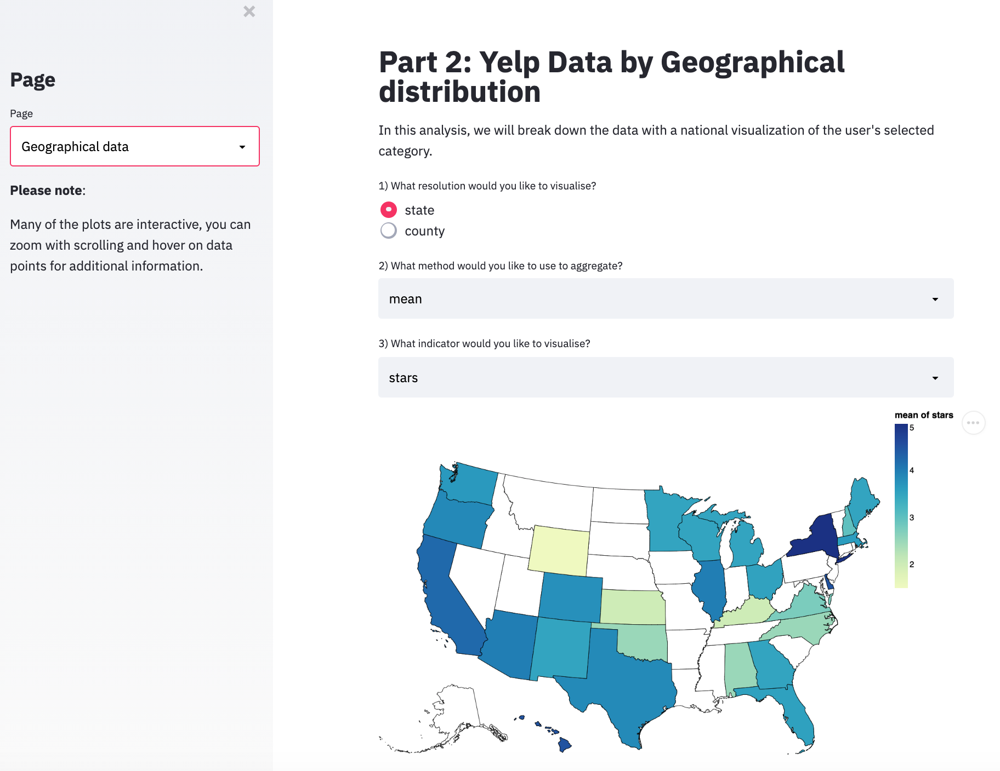

# National and Statewide Business Yelp Analysis in the United States 

Our project scope was to create a Streamlit dashboard in Python for Yelp's analytics team to understand the breakdown of Yelp categories and businesses to help them better target and optimize businesses in the United States. We utilized the dataset from Yelp's website (https://www.yelp.com/dataset) which consists of information around businesses listed on Yelp. We focused on county and state data by category. We leveraged Altair to create different visualization and patterns in order to find insightful ways to exploring our existing data. 

## Project Goals

Purpose: Analyze Yelp businesses by region in order to identify investment and business opportunities for the team at Yelp. We wanted to help visualize to the user where could Yelp encourage incentives for new businesses and what business categories may be effective given the area and region. We allowed users to segment different restaurant characteristics by several factors including location, reviews and ratings. 

Additionally, we wanted to utilize the concepts we learned in class such as density, color and white space to drive more clarity in our visualizations. 

## Data Set
We utilized Yelp data from their business database. The database had multiple columns including a unique business ID, business name, location (address / state / city / longitude / latitude), reviews, takeout options and even bitcoin exchange availability.

We had to feed in the data into usable dataframes that was structured for us to use. 

## Design

The visual encodings and interaction types were selected due to the ability of the end user to comprehend and digest the data. We leveraged interactive components to help the user personalize and adjust the data around what is most useful for them. 

**Part 1: Understanding the Data** 
We created a section to first expose our end user to the types of data we leveraged in our project. The end user can select the checkbox in order to see the types of data that is available in the Yelp dataset. 

**Part 2: Breaking Down Categories by State** 
For our first interaction, we created a drop down selection for our user to select the type of category we are able to find in each state by distribtuion. In order to improve the performance and help narrow down the analysis paralysis, we filtered for the top 15 states in order to evaluate significant trends. 

The bar chart simplifies the chart and is easily digestible for our users. However, if the user is interested in more detail, they are able to expand the chart or download the chart for their convenience. 

**Part 3A: Breaking Down Businesses by State or County - Statistical Data**
The second part of the assignment allowed us to leverage graphs in Altair to create interactive visualizations of state and county data. Streamlit allowed us to be flexible in the type of data that we wanted to visualize. We could evaluate stars, review and even if the establishment accepted Bitcoin. We believe this gives the end user more flexiblity to do more analysis. Additionally, to extend the statistical analysis, we allowed the user to evaluate the mean, min or max as part of their analysis.

We considered an aggregate visualization of the data but we realized it did not give us as much flexibility to understand where the majority of businesses fall in a specific area. We also considered a text bubble chart but did not find the insights particularly engaging. 

**Part 3B: Breaking Down Businesses by State or County - Geographic Data** 
We also allowed users to toggle between pages to switch between the statistical and geographic data. Once a user toggles to geographic data, they can view the same segmentations above across the United States. This graph created a strong visual that illustrated the data in a dynamic way to the user. The density of the color also provides insight into the quantity. 

## Development

Shicheng and Jennifer both identified the dataset that we wanted to tackle and outlined the initial questions that we wanted to answer. Then we spend individualized time to refine the visualizations and organization of data that we wanted to leverage. Jennifer worked on the first component of the Streamlit application and Shicheng worked on Part 2 of the graphs and data set. 

As a Human Computer Interaction student and fledgling in Python, Jennifer spend over 20 hours on her part of the code and working with Python. She worked on getting the categories into columns and then getting the count of the categories. Shicheng also spent 20 hours on his part of the Streamlit visualizations into our analysis. Shicheng worked on complex visualizations and adding more interactivity to the graphs. 

## Success Story

We observed a number of interesting insights while working on the visualizations

1) States with dense metropolitan cities (e.g New York, California) had the highest mean of 5 stars. 

2) Florida has a significantly higher ratio of Beauty categories to Hotels. 
